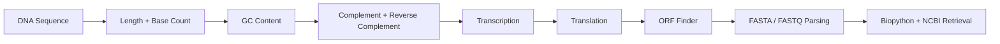

# Bioinformatics Python Basics

<p align="center">
  <strong>A beginner-friendly Python learning repo for core bioinformatics scripting, sequence analysis, FASTA/FASTQ handling, Biopython, and simple NCBI data retrieval.</strong>
</p>

This repository contains small, readable Python scripts for learning practical bioinformatics programming step by step.  
The code is intentionally written in a simple style so beginners can understand the logic before moving into larger NGS, genomics, and omics workflows.

---

## What This Repository Teaches

| Area | What You Learn |
|---|---|
| Python basics | Functions, conditionals, loops, strings, dictionaries, and files |
| DNA/RNA basics | Sequence length, nucleotide counting, complement, reverse complement, transcription |
| Protein basics | RNA-to-protein translation and ORF detection |
| FASTA/FASTQ handling | Reading sequence files and summarizing records |
| Sequence analysis | GC content, motif search, k-mer counting, codon usage, sequence identity |
| Biopython basics | NCBI sequence retrieval, PubMed search, Gene search, and GenBank parsing |
| Portfolio practice | Clean folder structure, readable scripts, and GitHub-friendly documentation |

---

## Learning Flow



---

## Repository Structure

```text
.
├── scripts/
│   ├── dna_length_calculator.py
│   ├── gc_content_calculator.py
│   ├── complement_dna_strand.py
│   ├── reverse_complement.py
│   ├── motif_finder.py
│   ├── transcription_dna_to_rna.py
│   ├── translation_rna_to_protein.py
│   ├── fasta_reader_basic.py
│   ├── biopython_sequence_fetch.py
│   ├── ncbi_pubmed_search_basic.py
│   ├── fasta_gc_summary.py
│   ├── fastq_quality_summary.py
│   ├── kmer_counter.py
│   ├── codon_usage_counter.py
│   ├── orf_finder.py
│   ├── restriction_site_finder.py
│   ├── pairwise_sequence_identity.py
│   ├── translate_fasta_sequences.py
│   ├── genbank_parser_basic.py
│   └── ncbi_gene_search_basic.py
├── examples/
│   ├── example_sequence.fasta
│   └── example_reads.fastq
├── docs/
│   └── learning_notes.md
├── archive/
│   ├── original_versions/
│   └── python_practice/
├── README.md
├── requirements.txt
├── LICENSE
└── .gitignore
```

---

## Scripts Included

### Core beginner scripts

| Category | Script | Purpose |
|---|---|---|
| DNA basics | `dna_length_calculator.py` | Calculates DNA sequence length and nucleotide counts |
| DNA basics | `gc_content_calculator.py` | Calculates GC percentage of a DNA sequence |
| DNA basics | `complement_dna_strand.py` | Generates the complement DNA strand |
| DNA basics | `reverse_complement.py` | Generates the reverse complement DNA strand |
| DNA basics | `motif_finder.py` | Searches for a motif inside a DNA sequence |
| RNA/protein | `transcription_dna_to_rna.py` | Converts DNA sequence to RNA sequence |
| RNA/protein | `translation_rna_to_protein.py` | Translates a simple RNA sequence into protein sequence |
| File parsing | `fasta_reader_basic.py` | Reads a FASTA file without external libraries |
| Biopython | `biopython_sequence_fetch.py` | Fetches a sequence record from NCBI using Biopython |
| Biopython | `ncbi_pubmed_search_basic.py` | Searches PubMed records using Biopython Entrez |

### New expanded scripts

| Category | Script | Purpose |
|---|---|---|
| FASTA analysis | `fasta_gc_summary.py` | Calculates length and GC content for each FASTA record |
| FASTQ analysis | `fastq_quality_summary.py` | Reads FASTQ records and calculates average quality scores |
| Pattern analysis | `kmer_counter.py` | Counts k-mers in a DNA sequence |
| Coding sequence | `codon_usage_counter.py` | Counts codons in a coding DNA sequence |
| Protein prediction | `orf_finder.py` | Finds simple open reading frames in DNA |
| Restriction analysis | `restriction_site_finder.py` | Finds common restriction enzyme sites |
| Sequence comparison | `pairwise_sequence_identity.py` | Calculates simple percent identity between two aligned sequences |
| Protein translation | `translate_fasta_sequences.py` | Translates FASTA DNA records into protein sequences |
| Biopython/GenBank | `genbank_parser_basic.py` | Parses basic GenBank record information |
| NCBI retrieval | `ncbi_gene_search_basic.py` | Searches the NCBI Gene database using Biopython Entrez |

---

## Quick Start

Clone the repository:

```bash
git clone https://github.com/HazratMaghaz/Bioinformatics-Python-Basics.git
cd Bioinformatics-Python-Basics
```

Install optional dependencies:

```bash
pip install -r requirements.txt
```

Run a simple script:

```bash
python scripts/gc_content_calculator.py
```

Run a FASTA summary script:

```bash
python scripts/fasta_gc_summary.py
```

Run a FASTQ quality script:

```bash
python scripts/fastq_quality_summary.py
```

---

## Example Input and Output

Example DNA sequence:

```text
ATGCGTACGTTAGC
```

Example output:

```text
Sequence length: 14
A: 3
T: 4
G: 4
C: 3
GC content: 50.00%
```

---

## Why This Repository Exists

This repository documents my early Python learning journey in a bioinformatics-focused way.  
The scripts are intentionally simple and readable so beginners can understand the logic behind common sequence analysis tasks before moving to larger workflows such as RNA-seq, variant calling, metagenomics, and machine learning for biological data.

---

## Planned Additions

- Basic FASTQ filtering by quality score
- Simple primer design helper
- Pairwise alignment using Biopython
- BLAST result parser
- VCF reader for beginner variant analysis
- Mini RNA-seq count table parser
- Simple gene annotation table parser

---

## Archived Files

<details>
<summary><strong>Archived beginner Python practice files</strong></summary>

The `archive/python_practice/` folder contains early Python practice scripts such as loops, functions, pattern printing, and a simple Hangman game. These files are kept for learning history, but they are not part of the main bioinformatics workflow.

The `archive/original_versions/` folder contains older versions of some bioinformatics scripts before the repository was reorganized.

</details>

---

## Skills Demonstrated

- Basic Python syntax
- Functions and conditionals
- Loops and string handling
- DNA/RNA sequence processing
- FASTA and FASTQ file parsing
- Simple sequence comparison
- Codon and k-mer counting
- Beginner-level Biopython usage
- Clean GitHub repository organization

---

## Author

**Hazrat Maghaz**  
Bioinformatician | Computational Biologist | AI & Bioinformatics Enthusiast

[](https://hazratmaghaz.tech)
[](https://github.com/HazratMaghaz)
[](https://www.linkedin.com/in/hazrat-maghaz-6967b9374/)

---

## License

This repository is available under the MIT License. See the `LICENSE` file for details.

---

<p align="center">
  Built as part of a growing bioinformatics, computational biology, and AI portfolio.
</p>
